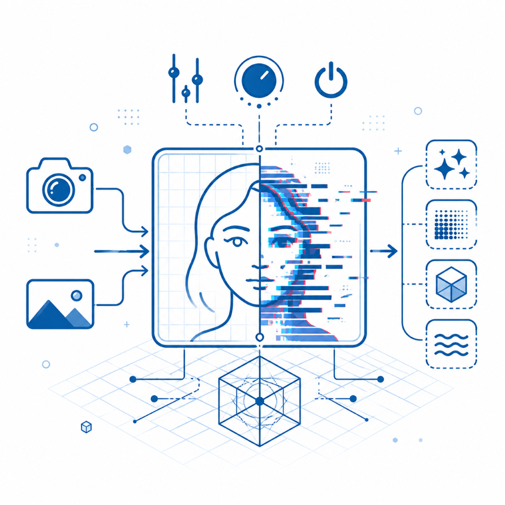

# ⚡ Image Vision Studio

> **Real-time image effects engine** — 30 WebGL/Canvas efektov v dvoch kategóriách, webcam podpora, before/after porovnanie, FPS counter, drag & drop, svetlý/tmavý režim. Čisto klientská aplikácia bez backendu.

---

## 🎯 O projekte

**Image Vision Studio** je interaktívna webová aplikácia vytvorená ako súčasť predmetu **B-MSAP** (Multimediálna webová služba). Umožňuje používateľovi nahrať fotografiu alebo zapojiť webkameru a v reálnom čase aplikovať **30 vizuálnych efektov** implementovaných pomocou **WebGL GLSL shaderov** a **HTML5 Canvas API**.

Celá logika beží **výhradne v prehliadači** — žiadny backend, žiadny server, žiadne externé API.

---

## ✨ Efekty (30 spolu)

Efekty sú rozdelené do dvoch kategórií, ktoré sa prepínajú tabmi v spodnom paneli.

### 📷 + 🖼️ Obrázok + Kamera (21 efektov)

Fungujú na statickom obrázku aj na živej webkamere.

| Efekt | Technológia | Popis |
|---|---|---|
| ⚡ **Cyber Glitch** | GLSL | Náhodné horizontálne posuny pásov, RGB split a digitálny šum |
| 🔮 **Neon Edge** | GLSL · Sobel | Detekcia hrán s rotujúcou neónovou paletou na čiernom pozadí |
| 🌡️ **Thermal** | GLSL | Termovízna paleta — modrá → fialová → oranžová → žltá |
| 📟 **ASCII Art** | Canvas 2D | Mozaika ASCII znakov so zachovaním farby pôvodného pixelu |
| 🌀 **Kaleidoskop** | GLSL | Radiálne zrkadlenie do 4–12 segmentov, ovládané pohybom myši |
| 🎨 **Oil Paint** | GLSL · Kuwahara | Vyhladenie do oblastí konštantnej farby s ostrými hranicami |
| 🔲 **Pixelate** | GLSL | Hard pixelácia do rovnakých blokov (220 → 18 buniek) |
| ✏️ **Sketch** | GLSL | Edge detection invertovaný do bielej + diagonálne šrafovanie |
| 💥 **Comic Book** | GLSL | Kvantizácia farieb na 3–8 úrovní + čierne kontúry |
| 📼 **VHS Retro** | GLSL | Tape artefakty — chroma smear, tracking line, dropout, magenta cast |
| 🖥️ **CRT Screen** | GLSL | Barrel distortion, Trinitron sub-pixel mask, phosphor glow, scanlines |
| 💫 **Blur Focus** | GLSL | Radiálne depth-of-field — stred ostrý, okraje rozmazané |
| 🌙 **Night Vision** | GLSL | Gamma boost, edge enhance, zelený phosphor tint, šum |
| 🌈 **RGB Split** | GLSL | Chromatic aberration so smerom riadeným pozíciou myši |
| 🎭 **Posterize** | GLSL | Kvantizácia každého RGB kanála na 2–12 úrovní |
| 🎴 **Duotone** | GLSL | Cyklujúce tritone palety (Sunset, Ocean, Lava, Forest, Violet) |
| 👽 **Hologram** | GLSL | Cyan phosphor tint, scan páskovanie, pulzujúce pruhy, flicker |
| 💚 **Matrix Rain** | Canvas 2D | Padajúce zelené japonské znaky cez stmavnutý zdrojový obraz |
| 💧 **Liquid Wave** | GLSL | Multi-octave sine waves zvlnia obraz ako vodnú hladinu + kaustiky |
| 🪨 **Emboss** | GLSL | 3D reliéf — luminance gradient s warm metallic tintom |
| 📰 **Halftone** | GLSL | Newspaper raster — dot size podľa jasu, krémový papier, CMYK misregister |

### 🎬 Iba Kamera (9 efektov)

Závisia od pohybu alebo časovej histórie — vyžadujú aktívnu webkameru.

| Efekt | Technológia | Popis |
|---|---|---|
| ⏱ **Time Warp** | Canvas 2D | Horizontálny sken — postupne zachytí obraz líniu po línii a zmrazí ho |
| 🪞 **Mirror Dream** | Canvas 2D | Rorschach-style symetrické zrkadlenie (horizontálne + vertikálne) |
| 🌌 **Mirror Tunnel** | Canvas 2D | Koncentrické mirror rings — 1–14 vrstiev s alternujúcim zrkadlením |
| 🌪 **Swirl Vortex** | Canvas 2D | Radiálne víriace skreslenie cez per-pixel UV warp |
| 🌊 **Slit Scan** | Canvas 2D | Každý vertikálny pás z iného času (60-frame ring buffer) |
| ✨ **Stardust** | Canvas 2D | Partikulový systém — z jasných pixelov vyletujú svietiace iskry |
| 💀 **Datamosh** | Canvas 2D | Korumpované video — náhodné freezy, displacement bands, RGB tear |
| 🌈 **RGB Delay** | Canvas 2D | R/G/B kanály z rôznych časových delay cez multiply+lighter |
| 📡 **Sci-Fi Scanner** | Canvas 2D | Desaturuje base, scan band reveláciu farieb akumuluje a vybledne |

> **Tip:** Pri kliknutí na camera-only efekt bez aktívnej kamery sa zobrazí inštrukcia ako spustiť kameru.

---

## 🚀 Ako používať

### 1. Vstup
- **📷 Kamera** — klikni na tlačidlo `KAMERA` alebo `Štart Kamera`, prehliadač požiada o povolenie
- **📁 Upload** — klikni `UPLOAD`, alebo potiahni súbor (JPG · PNG · WEBP) priamo do okna (drag & drop)
- **Hub ring** — animovaný kruh v strede prázdnej obrazovky tiež otvára file picker po kliknutí

### 2. Výber efektu
Tabmi v spodnom paneli sa prepína medzi kategóriami:
- **📷+🖼️ OBRÁZOK + KAMERA** — 21 efektov pre oba zdroje
- **🎬 IBA KAMERA** — 9 real-time efektov závislých od pohybu

Hover nad tlačidlom efektu zobrazí stručný popis (čo robí, ako vyzerá výsledok).

> **⏱ Time Warp** je špeciálny — po prvom kliknutí ho aktivuješ, **druhým kliknutím spustíš sken**. Scanline prejde celým obrazom raz a zastaví sa.

### 3. Intenzita a ovládanie
- Slider **INTENZITA** (0–100) ovláda silu efektu
- Koliesko myši nad canvasom tiež mení intenzitu (rýchlejšie ladenie)
- Pohyb myši ovláda **Kaleidoskop**, **Time Warp** a **RGB Split**

### 4. Compare (Before / After)
Tlačidlo **⇆ COMPARE** v pravom hornom rohu zapne split-screen porovnanie:
- Vľavo originál (PRED), vpravo aplikovaný efekt (PO)
- Ťahaním vertikálnej rukoväte meníš pomer pred/po
- Funguje aj pre živú kameru — porovnáš efekt v reálnom čase

### 5. FPS counter
Po aktivovaní zdroja sa v ľavom hornom rohu objaví **FPS badge** s farebnou indikáciou:
- 🟢 zelená — 40+ FPS (plynulé)
- 🟡 žltá — 20–39 FPS
- 🔴 červená — pod 20 FPS

### 6. Theme toggle
Tlačidlo **☀️/🌙** prepína svetlý a tmavý režim celého rozhrania.

### 7. Uloženie
Tlačidlo **💾 ULOŽIŤ** stiahne aktuálny frame ako PNG s bielo-záblesk efektom (snapshot flash).

### 8. Reset
Tlačidlo **×** v rohu canvasu zastaví kameru, vymaže obrázok a vráti aplikáciu do úvodného stavu (hub ring).

---

## 🛠️ Technický stack

**HTML5 + CSS3 + JavaScript (ES2020+)**

**WebGL 1.0 (GLSL ES 1.0) — 19 fragment shaderov:**
- Cyber Glitch, Neon Edge (Sobel), Thermal, Kaleidoscope
- Oil Paint (Kuwahara filter — `precision highp float`)
- Pixelate, Sketch, Comic Book, VHS Retro, CRT Screen
- Blur Focus, Night Vision, RGB Split, Posterize
- Duotone (5-palette tritone cycler), Hologram
- Liquid Wave (multi-octave sine + caustics), Emboss
- Halftone (CMYK-style dot raster)

**Canvas 2D API — 11 efektov + overlay:**
- ASCII Art renderer
- Matrix Rain (animated falling characters)
- Time Warp scan system (frame-by-frame freeze)
- Mirror Dream (Rorschach symmetry)
- Mirror Tunnel (concentric mirror rings)
- Swirl Vortex (per-pixel polar UV warp)
- Slit Scan (ring buffer of frames)
- Stardust (380-particle system s motion trails)
- Datamosh (random freeze + RGB tear)
- RGB Delay (channel-separated time delay)
- Sci-Fi Scanner (accumulator-based scan band)
- Vignette + Film Grain overlay

**Web APIs:**
- MediaDevices API — webcam capture s error handling
- FileReader API — image upload + drag & drop
- Google Fonts — Space Grotesk

**Žiadne závislosti.** Žiadny npm, žiadny build step. Jeden súbor `index.html`.

---

## 🎨 UI/UX features

- **Dark / Light Mode** — prepínač ☀️/🌙 v pravom hornom rohu
- **Glassmorphism** design — `backdrop-filter: blur` panely + animované gradient headery
- **Tab navigation** — kategorizované menu efektov s farebným odlíšením (purple = universal, pink = cam-only)
- **Animovaný hub ring** — pulzujúci kruh s dvojitým radial outline na úvodnej obrazovke
- **Drag & Drop** — overlay zóna pri pretiahnutí súboru
- **Compare slider** — drag handle s ⇆ ikonou + PRED/PO labels
- **FPS counter** — real-time indikácia výkonu s farebnými stavmi
- **Per-button tooltips** — hover popis pre každý z 30 efektov (position:fixed, obchádza backdrop-filter clipping)
- **Snapshot Flash** — biely záblesk pri uložení
- **Film Grain + Vignette** — subtílny filmový overlay nad každým efektom
- **Cam-only disabled state** — efekty vyžadujúce kameru sú pri uploadnutom obrázku vizuálne stlmené s 📷 markerom
- **Help tooltip** — `?` ikona vpravo dole s prehľadom ovládania a kategórií
- **Responzívny** — prispôsobí sa rozlíšeniu zdroja
- **Error handling** — prehľadné hlášky pri zamietnutí kamery, nepodporovanom formáte, atď.

---

## ⚙️ Performance optimalizácie

- **Half-resolution per-pixel efekty** — Swirl Vortex pracuje na 50% res s upscaleom
- **Downsampled motion sampling** — Stardust skenuje jasné pixely v 1/10 rozlíšení
- **Throttled grain regeneration** — overlay šum sa regeneruje každý 3. frame
- **Cached canvas buffers** — reusable workA/workB pracovné canvasy
- **Ring buffers** — Slit Scan (60 frames), RGB Delay (30 frames)
- **Auto-cleanup** — webcam stream sa korektne uvoľní pri unload/reset/page hide
- **Auto-switch** — pri uploade obrázka sa automaticky prepne z camera-only efektu na universal
- **WebGL preserveDrawingBuffer** — umožňuje canvas snapshot pre uloženie

---

## 📁 Štruktúra repozitára

- `index.html` — celá aplikácia (HTML + CSS + JS + GLSL)
- `thumbnail.png` — náhľad pre portál (1000 × 1000 px)
- `README.md` — tento súbor

---

## 🧩 Zaradenie do portálu B-MSAP

Projekt je navrhnutý pre integráciu do centrálneho portálu:

- `index.html` obsahuje tlačidlo **← Späť na portál** (`href="/"`)
- `thumbnail.png` má rozmer presne **1000 × 1000 px**
- Žiadny backend — aplikácia pobeží aj o roky bez údržby

---

## 👤 Autor

**Dominik Kudela** · B-MSAP · 2025/2026

---

*Image Vision Studio — kde každý pixel rozpráva príbeh.*